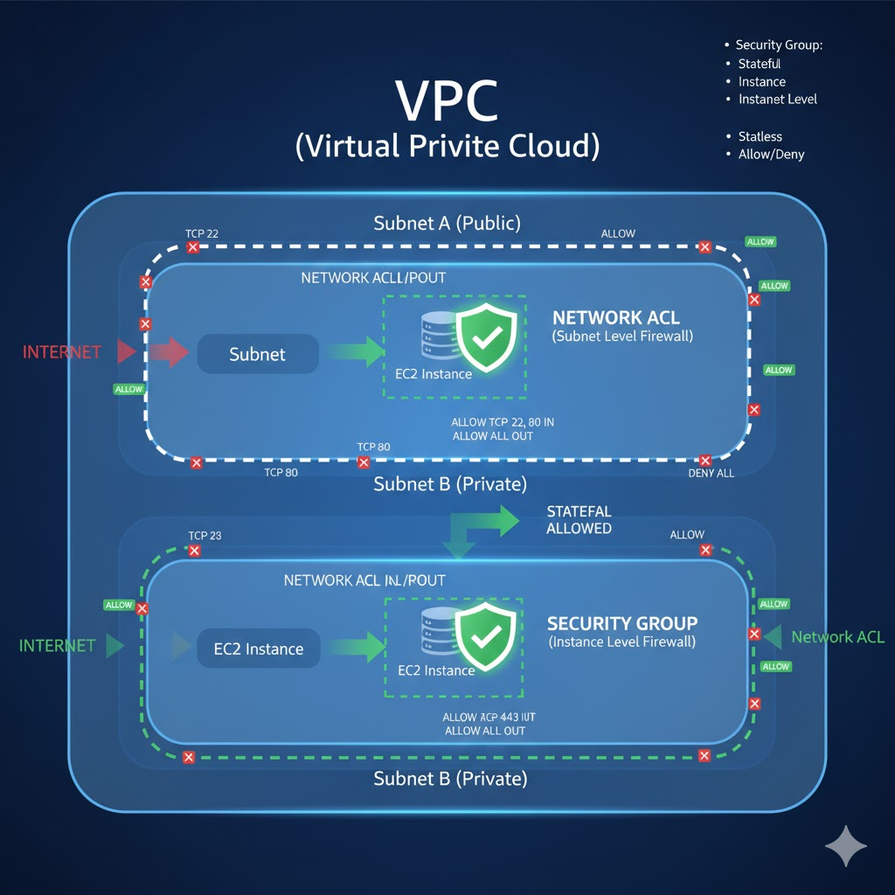

네, 보안 그룹(Security Group)과 네트워크 ACL(Network Access Control List)이 어떤 영역을 커버하는지 시각적으로 설명해 드릴게요.

**VPC (Virtual Private Cloud)** 내부에 여러 **서브넷(Subnet)**이 있고, 각 서브넷 안에 **EC2 인스턴스(EC2 Instance)**와 같은 리소스들이 있다고 가정해 봅시다.

---

### 🖼️ 보안 그룹과 네트워크 ACL의 적용 범위 다이어그램

**그림 설명:**

1.  **VPC (Virtual Private Cloud):** 클라우드 상의 격리된 가상 네트워크 공간입니다. 모든 AWS 리소스가 이 안에 있습니다.
2.  **서브넷 (Subnet):** VPC를 논리적으로 분할한 작은 네트워크입니다. 이 그림에서는 "Subnet A (Public)"와 "Subnet B (Private)" 두 개의 서브넷이 있습니다.
3.  **EC2 인스턴스 (EC2 Instance):** 각 서브넷 안에 있는 가상 서버입니다.

---

### 1. 네트워크 ACL (Network Access Control List)

* **적용 범위:** 다이어그램에서 **파란색 실선 박스**로 표시된 영역, 즉 **서브넷 전체**에 적용됩니다.
* **작동 방식:** 서브넷의 **경계**에서 인바운드(IN) 및 아웃바운드(OUT) 트래픽을 필터링합니다.
    * **Subnet A**의 경우, 인터넷에서 서브넷 A로 들어오는 트래픽과 서브넷 A에서 인터넷으로 나가는 트래픽을 모두 네트워크 ACL이 제어합니다.
    * **Stateless**이므로, 인바운드 트래픽을 허용하더라도 그에 대한 아웃바운드 응답 트래픽도 **명시적으로 허용**해야 합니다.
* **비유:** 서브넷이라는 도시의 **국경 검문소**와 같습니다. 모든 출입 차량을 검사하며, 들어오는 차량과 나가는 차량에 대한 규칙을 따로 적용합니다.

---

### 2. 보안 그룹 (Security Group)

* **적용 범위:** 다이어그램에서 **녹색 점선 박스**로 표시된 영역, 즉 **개별 EC2 인스턴스**에 적용됩니다.
* **작동 방식:** 인스턴스 **앞단**에서 트래픽을 필터링합니다. 네트워크 ACL을 통과한 트래픽이 인스턴스에 도달하기 전에 보안 그룹에서 한 번 더 검사됩니다.
    * **Subnet B**에 있는 EC2 인스턴스 주변에 보안 그룹이 있는 것을 볼 수 있습니다.
    * **Stateful**이므로, 인바운드 트래픽을 허용하면 그에 대한 아웃바운드 응답 트래픽은 **자동으로 허용**됩니다.
* **비유:** EC2 인스턴스라는 건물의 **입구 문지기**와 같습니다. 승인된 손님만 건물 안으로 들여보내고, 일단 들어온 손님은 자유롭게 나갈 수 있도록 합니다.

---

**요약하자면,**

* **네트워크 ACL**은 서브넷이라는 **울타리의 경계**를 보호하며, 통과하는 모든 트래픽에 대해 **엄격하게 인바운드/아웃바운드를 개별 검사**합니다.
* **보안 그룹**은 EC2 인스턴스라는 **개별 건물의 입구**를 보호하며, 일단 통과된 트래픽에 대해서는 **응답 트래픽을 자동으로 허용**합니다.

이 두 가지 방화벽은 함께 작동하여 AWS 환경의 보안을 다층적으로 강화합니다.