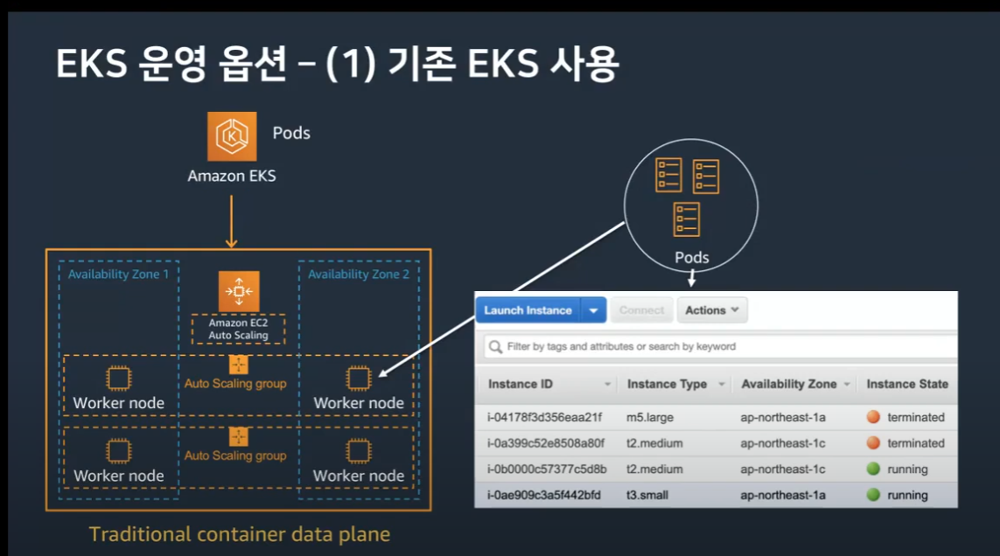
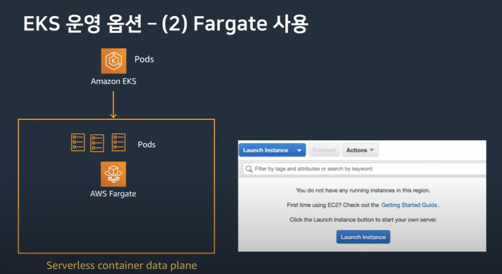
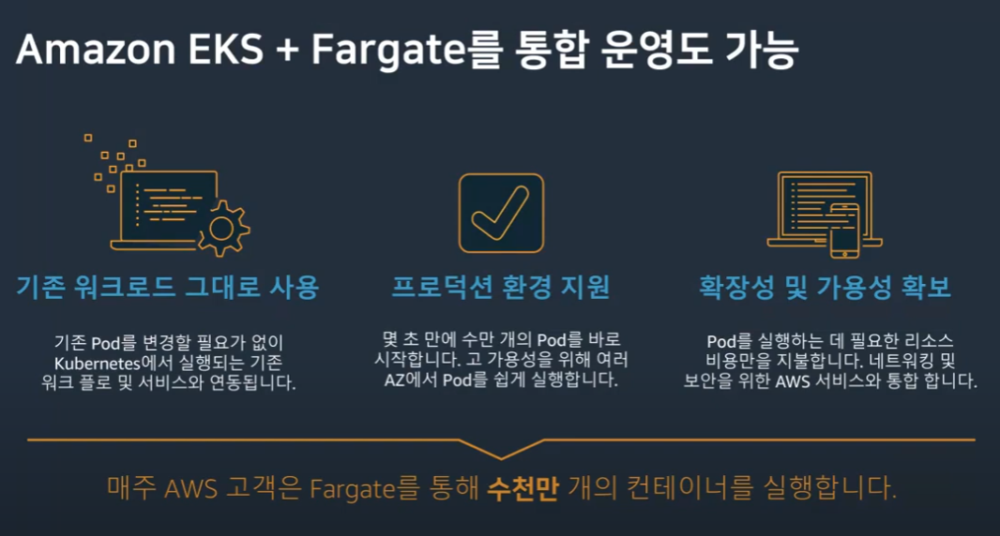
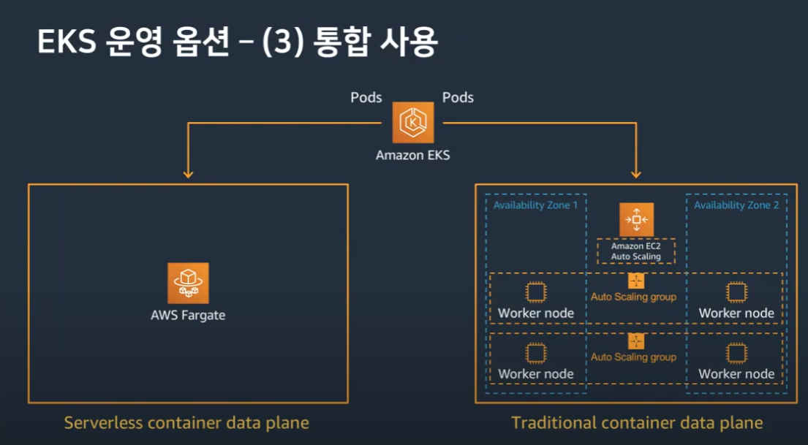
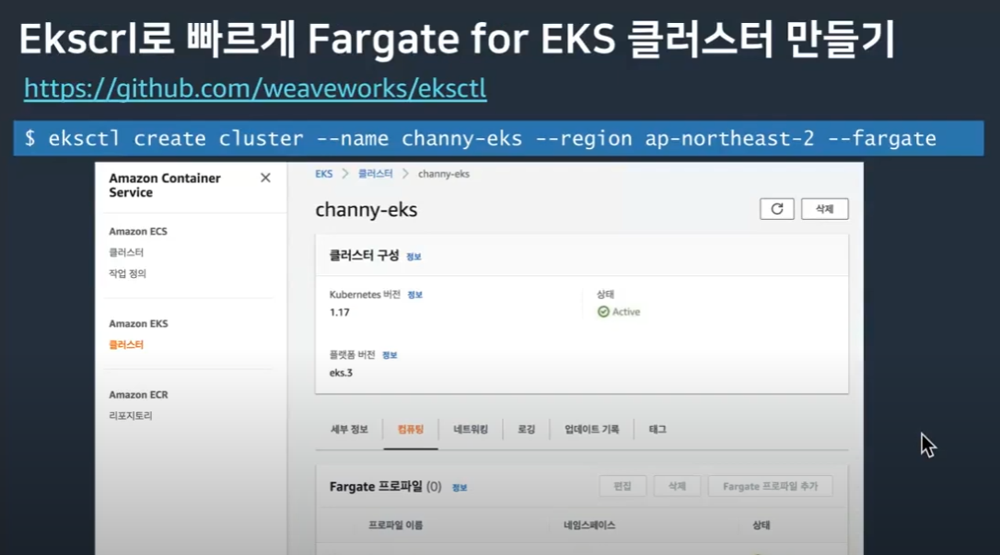
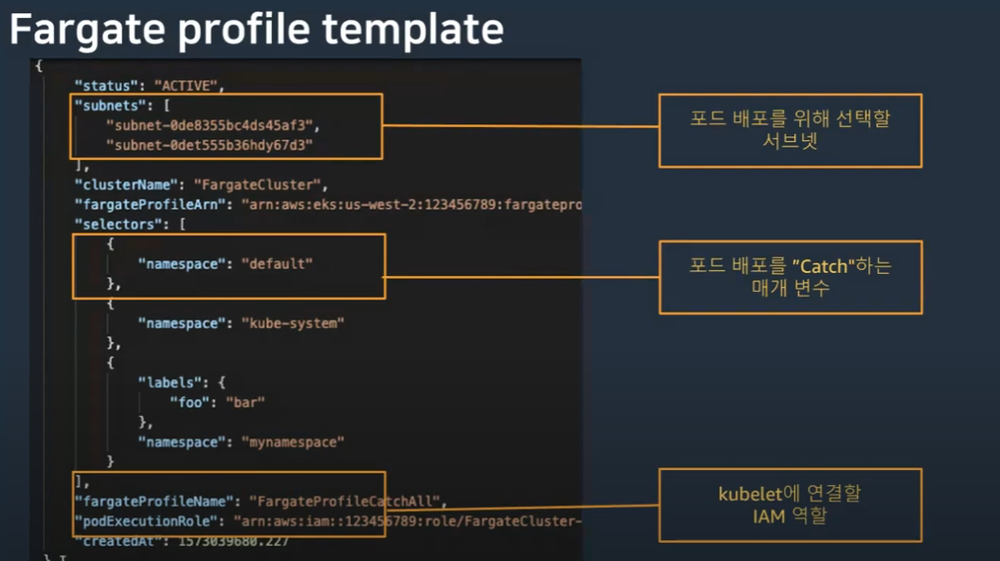
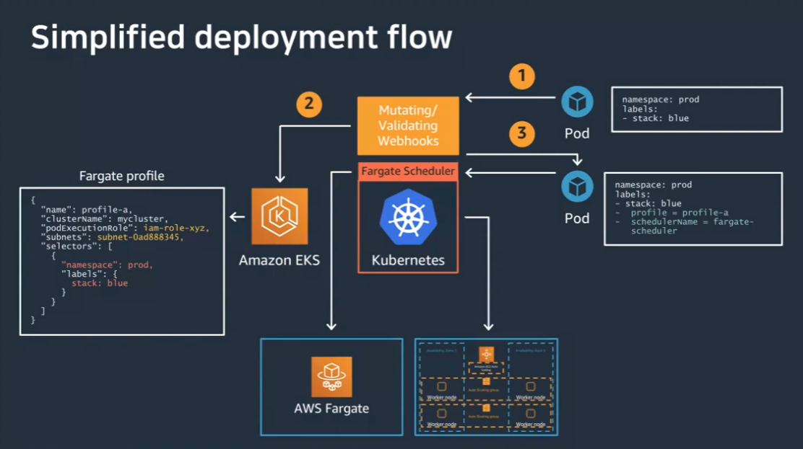

## EKS 개요

> 참조 : https://www.youtube.com/watch?v=Ibe3FoLwAq0&list=WL&index=6&t=10s

EKS는 서버리스 기반 Kubernetes 관리 서비스(컨테이너 오케스트레이션 서비스)

* **오케스트레이션** : 컨테이너 기반 애플리케이션의 배포, 예약, 확장 및 관리
* **호스팅** : 컨테이너(Task, Pod)가 실행되는 위치
* **이미지 저장** : 컨테이너 이미지를 저장하는 위치

기존에도 AWS는 ECS(Elastic Container Service)로 서비스를 제공하고 있었지만
EKS가 출시된 이후로는 **오프소스 기반의 Kubernetes**를 사용하기 위해 EKS를 많은 사람들이 사용하게 되었다.

둘 다 호스팅을 위해서는 **EC2 인스턴스** 위에 **ECS의 Task**나 **EKS의 Pod**을 띄우게 된다.

## Fargate 개요

Task가 Pod이 서버에 세팅을 해서 서버에 올라간 이미지를 가지고 오케스트레이션을 하게 되는데, 
이 서버(인스턴스)를 관리하게 되는 부담이 점점 커지게 됨.

이를 줄이는게 **서버리스 기반 Fargate이다**.

Docker 기반의 인스턴스 관리가 없는 것을 Fargate라 한다.

기존 EC2 인스턴스에서 호스팅 하던 것을 Fargate에 올려서 똑같이 호스팅 가능하다.


``` 
# EC2 호스팅
ECS                  EKS
 |                    |   
 |                    |
 ㅏ-------------------+
 |
EC2                Fargate
 +--------------------+
            |
           ECR
 (Elastic Container Registry)
     컨테이너 이미지 저장소  


# Fargate 호스팅
ECS                  EKS
 |                    |   
 |                    |
 +-------------------ㅓ
                      |
EC2                Fargate
 +--------------------+
            |
           ECR
 (Elastic Container Registry)
     컨테이너 이미지 저장소  
```

> ECR(Elastic Container Registry)란 컨테이너 이미지를 저장해주는 저장소 서비스

## EKS 운영 옵션

### EC2 기반

* 오픈 소스 업스트림 Kubernetes 활용
    * 표준 Kubernetes API를 사용함
    * 커뮤니티 도구와 함께 작동함

* 고 가용성 제공
    * 프로덕션 워크로드 용으로 구축된 모든 클러스터는 고 가용성이다. 99.9% SLA가 지원된다.
    > SLA(Service Level Agreement, 서비스 수준 계약)는 공급업체가 고객에게 제공하기로 약속한 서비스 수준을 명시하는 아웃소싱 및 기술 공급업체 계약
    > 만약 1분이라도 G마켓 같은 쇼핑 사이트가 마비될 경우 AWS측에서 어느 정도의 보상을 할지 합의하는 계약이다.

* AWS 서비스와 유기적인 통합
    * VPC 네트워킹, Elastic Load Balancing, IAM 권한, CloudWatch 등 이용 가능



EKS를 런칭을 하면 Pod들이 EC2의 Auto Scaling을 기반으로 해서 Worker Node에 배포가 되기 시작한다. 해당 팟들이 EC2 콘솔에 있는 인스턴스에 탑재가 된다.


### Fargate 기반

Fargate는 EC2 인스턴스와 달리 AWS에서 전체 서버의 확장이나 모든 것들을 관리해준다.

* AWS에서 오케스트레이션 자동 관리
    * 프로비저닝, 확장 또는 관리 할 EC2 인스턴스가 없음

* 탄력성 및 자동 확장
    * 원활하게 트래픽에 따라 확장 및 축소 및 사용한 만큼만 비용 지불

* AWS 서비스와 유기적인 통합 
    * VPC 네트워킹, Elastic Load Balancing, IAM 권한, CloudWatch 등. Kubernetes Pod과 연계 가능



서버를 관리할 필요가 없어서 서버 콘솔에서 아무것도 안보임


### 통합 운영



EKS + Fargate를 통합하여 운영 가능




## 간단 팁들

### Eksctl (EKS 컨트롤)



Eksctl이란 오픈소스로 만들어진 EKS 관리하는 커맨드 라인

상기 이미지에 적인 '$ ekstl create cluster ...' 명령어를 이용하면 쉽게 클러스터 생성 가능

### Fargate 프로파일 템플릿 




### 배포 흐름도



1. 기본적으로 pod이 있다.
2. 이 pod을 쿠버네티스 관리하는 부분에 세팅을 하면, EKS로 넘어가게 된다. 여기서 Fargate Profile이 세팅이된다.
3. 쿠버네티스의 Fargate 스케쥴러를 통해서 어디로 pod을 배포할지 정해지게 된다.

