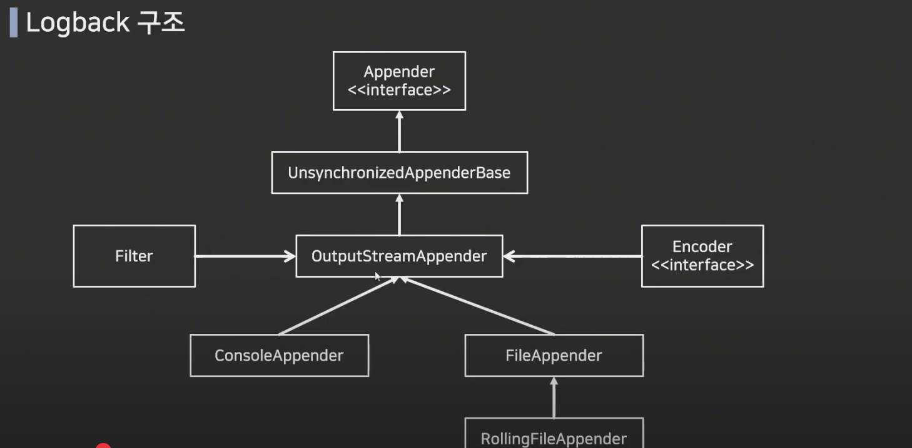

# LogBack 사용법

> 참조 : https://www.youtube.com/watch?v=fkwb8coxBJM&t=56s

---

### ✅ **Logback 개요와 로그 레벨 이해**

* **(00:01)** Logback은 `log4j` 기반으로 개발된 로깅 프레임워크로, **성능과 메모리 효율**이 향상됨.
* **로그 레벨**: TRACE < DEBUG < INFO < WARN < ERROR
  운영 환경에선 `INFO` 또는 `WARN`, 개발 환경에선 `DEBUG` 또는 `TRACE` 사용.
  * TRACE가 가장 상세함
  * DEBUG는 로그가 많이 나와서 성능 저하의 우려가 있음. 그래서 운영에서는 INFO나 WARN정도 사용.
  > 참조 : https://sharonprogress.tistory.com/198

* log4j > logback > log4j2 순으로 출시 

---

### ✅ **Logback의 주요 기능**

* **(02:09)** 설정 파일을 **주기적으로 스캔**하여, **어플리케이션 재시작 없이 설정 변경 가능**.
* **(03:14)** 자체적으로 **로그 압축 및 보관 기간 설정 지원** (예: 30일 후 삭제).
* **로그 출력 방식 선택 가능**: 콘솔, 파일, 메일, DB 저장 등.

---

### ✅ **Logback 설정 구조 설명**

* **(04:17)** Spring Boot는 `logback-spring.xml`을 기본 설정 파일로 사용.
* **(05:21)** 대표적인 Appender: Log의 형태 및 어디에 출력할지 설정하기 위한 영역

  * **ConsoleAppender** : 콘솔에 로그를 출력
  * **FileAppender** : 파일에 로그를 출력
  * **RollingFileAppender** (운영 환경에서 가장 일반적) : 여러 개의 파일을 순회하며 로그를 저장
  * SMTPAppender : 로그를 메일로 보냄
  * DBAppender : 데이터베이스에 로그를 저장

  

---

### ✅ **실제 설정 항목 설명**

* **Appender**: 로그 출력 위치 지정 (예: 콘솔, 파일)
* **Filter (ThresholdFilter)**: 출력할 로그 레벨 제한 (예: INFO 이상만 출력)
* **Encoder**: 로그 형식 지정 (예: 날짜, 레벨, 스레드, 클래스명, 메시지 등 패턴으로 설정)

---

### ✅ **루트 & 로거 설정 방식**

* **(08:29)** `root`는 전역 로그 설정, `logger`는 특정 패키지/클래스에 대한 지역 설정
* 루트 설정 시, 해당 레벨 이상 로그만 출력 (예: `INFO` 설정 시 `DEBUG`, `TRACE`는 출력되지 않음)

---

### ✅ **로그 패턴 커스터마이징**

* **(11:42)** `%d`, `%thread`, `%logger`, `%msg`, `%n` 등으로 로그 출력 형식 정의 가능
* 클래스 경로가 너무 길 경우 `%logger{30}` 등으로 **길이 제한 가능**

---

### ✅ **Spring Boot 프로젝트에 적용 실습**

* **(17:06)** Spring Boot Starter Web에는 Logback 의존성이 기본 포함
* `LoggerFactory.getLogger(클래스명.class)`를 통해 Logger 인스턴스 생성
* `logger.trace()`, `logger.debug()` 등으로 각 레벨 로그 출력 가능

---

### ✅ **중괄호 `{}` 포맷 사용 예시**

* **(22:32)** `"{} 처리되었습니다"` 같은 형태로 변수 값을 간결하게 로그에 삽입 가능
  (기존 `+` 연산보다 깔끔하고 효율적)

---

### ✅ **성능 분석을 위한 로그 시간 측정**

* **(24:39)** 메서드 시작/종료 시점 로그를 이용해 **응답 시간 측정** 가능
  (예: `startTime`과 `System.currentTimeMillis()` 활용)

---

### ✅ **전체 정리**

* Logback은 **확장성, 유연성, 성능**에서 강점을 가지며,
* **환경별 로그 레벨 및 출력 대상 설정**, **파일 압축 및 보관 정책**, **정교한 포맷 지정** 등 실전에서 매우 유용.
* Spring Boot 환경에선 **별도 의존성 추가 없이** 바로 적용 가능.

---

## 예시 및 코드


 영상에서 설명한 내용을 기반으로 \*\*Logback 설정 XML 파일(logback-spring.xml)\*\*과 **Java 코드 예시**를 각각 정리해드리겠습니다.

 Spring의 경우 logback.xml
 Spring boot는 logback-spring.xml

---

## ✅ 1. `logback-spring.xml` 설정 예시

(05:12) 확인 

```xml
<?xml version="1.0" encoding="UTF-8"?>
<configuration scan="true" scanPeriod="30 seconds">

    <!-- 로그 디렉토리 경로 설정 -->
    <property name="LOG_DIR" value="logs" />

    <!-- 콘솔 출력 설정 -->
    <appender name="Console" class="ch.qos.logback.core.ConsoleAppender">
        <filter class="ch.qos.logback.classic.filter.ThresholdFilter">
            <level>INFO</level> <!-- INFO 이상만 출력 -->
        </filter>
        <encoder>
            <pattern>%d{yyyy-MM-dd HH:mm:ss.SSS} [%thread] %-5level %logger{30} - %msg%n</pattern>
        </encoder>
    </appender>

    <!-- 롤링 파일 출력 설정 -->
    <appender name="RollingFile" class="ch.qos.logback.core.rolling.RollingFileAppender">
        <file>${LOG_DIR}/application.log</file>

        <rollingPolicy class="ch.qos.logback.core.rolling.TimeBasedRollingPolicy">
            <!-- 로그 파일 이름 규칙 및 압축 -->
            <fileNamePattern>${LOG_DIR}/archive/application.%d{yyyy-MM-dd}.log.gz</fileNamePattern>
            <maxHistory>30</maxHistory> <!-- 최대 보관 일수 -->
        </rollingPolicy>

        <filter class="ch.qos.logback.classic.filter.ThresholdFilter">
            <level>DEBUG</level> <!-- DEBUG 이상 출력 -->
        </filter>

        <encoder>
            <pattern>%d{yyyy-MM-dd HH:mm:ss.SSS} [%thread] %-5level %logger{30} - %msg%n</pattern>
        </encoder>
    </appender>

    <!-- 전역 루트 로거 설정 -->
    <root level="INFO">
        <appender-ref ref="Console"/>
        <appender-ref ref="RollingFile"/>
    </root>

    <!-- 예시: 특정 패키지에만 DEBUG 출력 -->
    <logger name="com.example.project" level="DEBUG" additivity="false">
        <appender-ref ref="RollingFile"/>
    </logger>

</configuration>
```

---

## ✅ 2. Java 코드 예시 (`HelloController.java`)

```java
package com.example.demo.controller;

import org.slf4j.Logger;
import org.slf4j.LoggerFactory;
import org.springframework.web.bind.annotation.*;

@RestController
@RequestMapping("/log")
public class HelloController {

    private static final Logger logger = LoggerFactory.getLogger(HelloController.class);

    @PostMapping("/test")
    public String logTest() {
        logger.trace("Trace level log");
        logger.debug("Debug level log");
        logger.info("Info level log");
        logger.warn("Warn level log");
        logger.error("Error level log");
        return "로그 테스트 완료";
    }
}
```

> **주의**: `logback-spring.xml`은 반드시 `resources` 폴더 아래에 위치해야 하며, Spring Boot는 `logback.xml`이 아닌 `logback-spring.xml`을 통해 Spring Profile 연동 등 추가 기능을 사용할 수 있습니다.

---

### ✅ 추가 팁

* 로그 레벨은 상위 레벨을 포함합니다. 예: `INFO` 설정 시, `WARN`, `ERROR`도 출력됨.
* 로그 포맷은 `%d` (시간), `%thread`, `%level`, `%logger`, `%msg`, `%n` 등의 태그로 구성.
* 중괄호 `{}`를 이용한 파라미터 치환도 꼭 익혀두세요:

  ```java
  logger.info("사용자 ID: {}, 이름: {}", userId, userName);
  ```


