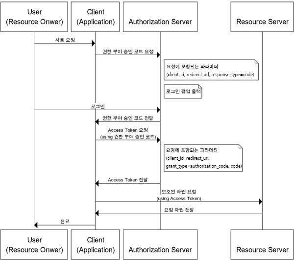

# OAuth 용어 정리


### 주요 용어

* **Authentication** : 인증, 접근 자격이 있는지 검증하는 단계
* **Authorization** : 인가, 자원에 접근할 권한을 부야하는 것. 인가가 완료되면 리소스 접근 권한이 담기 Acces Token이 클라이언트에게 부여된다.
* **Access Token** : 리소스 서버에게서 리소스 소유자의 보호된 자원을 획득할 때 사용되는 만료 기간이 있는 Token이다.
* **Refresh Token** : Access Token 만료시 이를 갱신하기 위한 용도로 사용하는 Toeken이다. Refresh Token은 일반저긍로 Access Token보다 만료 기간이 길다.

### OAuth의 4가지 역할

* **Resource Owner** :  리소스 소유자 또는 사용자. 보호된 자원에 접근할 수 있는 자격을 부여해 주는 주체. OAuth2 프로토콜 흐름에서 클라이언트를 인증(Authroize)하는 역할을 수행한다. 인증이 완료되면 권한 획득 자격(Authorization Grant)을 클라이언트에게 부여한다. 개념적으로 리소스 소유자가 자격을 부여하는 것이지만 일반적으로 권한 서버가 리소스 소유자와 클라이언트 사이에서 중개 역할을 수행한다.
* **Client** :  보호된 자원을 사용하려고 접근 요청을 하는 애플리케이션
* **Resource Server** : 사용자의 보호된 자원을 호스팅하는 서버.
* **Authorization Server** : 권한 서버. 인증/인가를 수행하는 서버로 클라이언트의 접근 자격을 확인하고 Access Token을 발급하여 권한을 부여하는 역할을 수행한다.


```
# 일반적인 OAuth flow chart

User(Resource Owner) --> Client(Application) --> Authorization Server --> Resource Server

```



> 참고 : https://blog.naver.com/mds_datasecurity/222182943542
