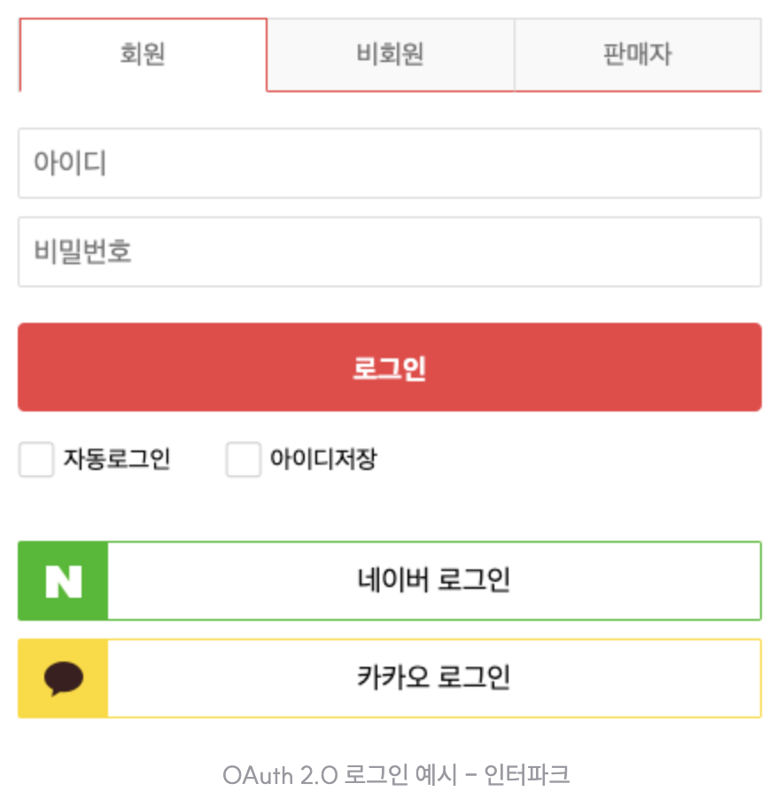
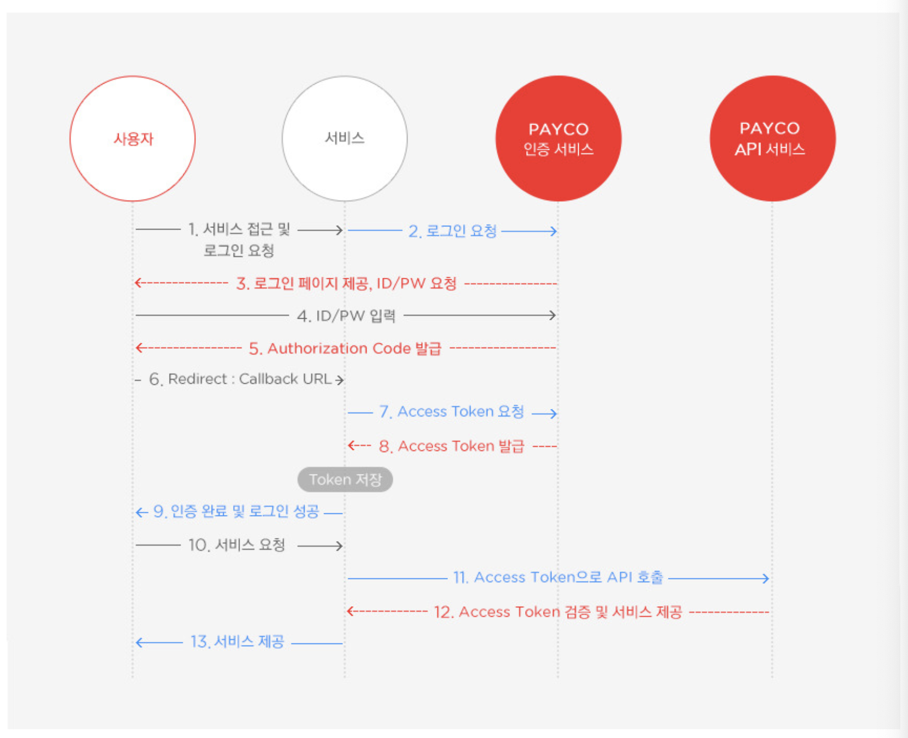

# OAuth(Open Authorization)란?

OAuth는 인터넷 사용자들이 비밀번호를 제공하지 않고 다른 웹사이트 상의 자신들의 정보에 대해 웹 사이트나 애플리케이션의 접근 권한을 부여할 수있는 공통적인 수단으로서 사용되는 접근 위임을 위한 개방형 표준

쉽게 말하면, 애플리케이션을 이용할 때, 사용자가 해당 애플리케이션에 ID, PW등의 정보를 제공하지 않고, 신뢰할 수 있는 외부 애플리케이션(Naver, Google, Facebook 등)의 Open API에 ID, PW를 입력하여 해당 애플리케이션의 인증 과정을 처리해 주는 방식이다.

1. 사용자가 서비스에게 서비스 접근 및 로그인 요청(소셜 로그인 버튼 클릭)

2. 서비스가 PAYCO 인증 서비스(Authorization Server)에 사용자 대신 로그인 요청

3. Authorization Server가 사용자에게 로그인 페이지 제공

4. 사용자가 ID, PW를 입력하여 Authorization Server에 요청하여 유효성 확인

5. 유효성이 확인되면, Authorization Server에서 사용자에게 Authorization Code 발급

6. 사용자가 서비스에게 Redirect Callback URL로 발급받은 Authorization Code를 담아서 요청

7. 서비스가 사용자가 전달한 Authorization Code를 사용하여 Authorization Server에 인증 요청(AccessToken 발급 요청)

8. Authorization Server에서 해당 Authorization Code를 검증 후 인증(AccessToken 발급) & 서비스에서 발급된 AccessToken 저장

9. 서비스에서 사용자의 인증 완료 & 로그인 성공 처리

10~13 : Resource Server로 발급받은 AccessToken을 사용하여 사용자의 해당 Resource(ID, 프로필 정보, ...)를 요청하여 응답받을 수 있다.

> 참조 : https://ksh-coding.tistory.com/62